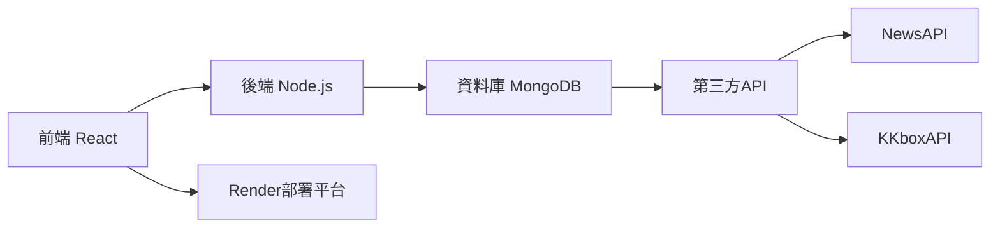

# Booooottle 漂流瓶專案
>拋出你的心事，撈起世界的溫度

## 專案簡介
Booooottle 是一個線上匿名漂流瓶平台，讓使用者透過「丟瓶子」分享心情，透過「撈瓶子」探索他人故事。專案結合了心情分享、運勢占卜、每日新聞與音樂等多元功能，創造溫暖的匿名交流空間。
**心靈漂流詩籤**  
>"Day by day I float my paper boats,  
>Hoping someone will find my notes."  
>讓每個日常心事，都化作漂流的詩句

🌐 **線上演示**：https://final-proj-mainpage.onrender.com
- 因資料庫續費問題，目前部分功能已無法使用
## 核心功能

### 🏠 主頁功能
- **丟瓶子**：每日可寫 6 段話（限 100 字）
- **撈瓶子**：次數無限制，撈取機率：
  - 今日瓶（70%）
  - 漂流瓶（29%）
  - 開發瓶（1%）
- **信箱系統**：查看丟出瓶子收到的留言
- **規則說明**：完整使用指南

### 🌊 指定水池
| 水池名稱 | 功能特色 | 每日限制 |
|----------|----------|----------|
| **今日灣** | 整合 NewsAPI + KKboxAPI 提供每日新聞與音樂榜 | 無限制 |
| **幸運河** | 抽取運勢籤詩（大吉9%/中吉20%/小吉20%/吉30%/小凶18%/凶3%） | 1次 |
| **漂流海** | 撈取其他用戶漂流瓶並留言互動 | 6次 |
| **開發池** | 查看開發者日誌（系統更新/debug問題等） | 2次 |

## 技術架構


## 團隊分工
| 成員         | 負責模組                                                                 |
|--------------|--------------------------------------------------------------------------|
| **林瑀涵**   | 全站 CSS 設計、瓶子動畫、運勢池功能、主頁撈取功能                         |
| **陳敏瑄**   | API 整合、資料庫架構、登入註冊系統、留言功能、瓶子核心邏輯                |

## 專案亮點
✨ 獨家運勢籤詩系統  
✨ 多重水池分類機制  
✨ 匿名社交互動設計  
✨ 跨平台響應式界面  
✨ 即時新聞音樂整合  

## 功能展示

  
### 登入介面
- 一鍵切換登入/註冊

**登入**


**註冊**


```markdown
> "Before you cast your bottle far,  
> A gentle sign-in, like a harbor bar."  
```
### 信箱系統
- 查看丟出瓶子收到的留言
- 顯示已讀／未讀狀態
- 點選查看留言詳細內容
  
**信箱介面示意圖**
  


**信件內容示意圖**  


```markdown
> "When the tide brings back a reply,  
> My heart blooms under the digital sky."
```
